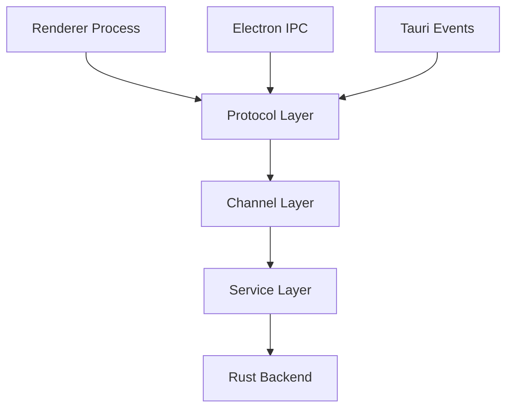

# IPC Migration Guide: Electron to Tauri

This guide documents the migration of Inter-Process Communication (IPC) from Electron to Tauri, focusing on maintaining compatibility while transitioning to Tauri's architecture.

## Overview

The migration preserves the three-layer IPC architecture:

1. **Protocol Layer**: Abstract interface for message passing
2. **Channel Layer**: Named channels for organized communication
3. **Service Layer**: High-level APIs for specific functionality

The key insight is that migration replaces only the protocol layer, keeping channels and services intact. This minimizes disruption to existing code.

### Architecture Flow



In Electron mode, the protocol uses `vscode:message` channel for all communication. In Tauri mode, each channel maps to dedicated Tauri commands and events.

## Architecture Changes

### IPC Patterns

| Pattern | Electron | Tauri |
|---------|----------|-------|
| Request-Response | `ipcRenderer.invoke()` → `ipcMain.handle()` | `invoke()` → `#[tauri::command]` |
| Events | `ipcRenderer.send()` → `ipcMain.on()` | `emit()` → `listen()` |

### Protocol Layer Changes

- **Electron**: Single `vscode:message` channel with JSON-RPC style messaging
- **Tauri**: Dedicated commands and events per channel, with native Rust serialization

## Implementation Details

### Simple Invoke/Handle Pattern

**Before (Electron):**

```typescript
// Renderer
const result = await ipcRenderer.invoke('vscode:fetchShellEnv');

// Main process
ipcMain.handle('vscode:fetchShellEnv', async () => {
  return process.env;
});
```

**After (Tauri):**

```typescript
// Renderer
const result = await invoke('fetch_shell_env');

// Rust
#[tauri::command]
async fn fetch_shell_env() -> Result<Value, String> {
    Ok(serde_json::to_value(std::env::vars().collect::<std::collections::HashMap<_, _>>()).unwrap())
}
```

### Event-Based Pattern

**Before (Electron):**

```typescript
// Renderer
ipcRenderer.send('vscode:toggleDevTools');

// Main process
ipcMain.on('vscode:toggleDevTools', () => {
  // implementation
});
```

**After (Tauri):**

```typescript
// Renderer
emit('toggle_dev_tools', {});

// Rust
#[tauri::command]
async fn toggle_dev_tools(window: tauri::Window) -> Result<(), String> {
    window.open_devtools();
    Ok(())
}
```

### Protocol-Based Implementation

The `TauriProtocol` implements `IMessagePassingProtocol` to bridge the gap:

```rust
pub struct TauriProtocol {
    app_handle: tauri::AppHandle,
}

impl IMessagePassingProtocol for TauriProtocol {
    async fn send(&self, channel: &str, data: Value) -> Result<(), Error> {
        self.app_handle.emit_all(channel, data).map_err(|e| Error::new(e))
    }

    async fn invoke(&self, channel: &str, data: Value) -> Result<Value, Error> {
        self.app_handle.invoke(channel, data).await.map_err(|e| Error::new(e))
    }
}
```

## Channel Mapping Table

| Electron Channel | Tauri Command/Event | Implementation File |
|------------------|---------------------|---------------------|
| `vscode:fetchShellEnv` | `fetch_shell_env` | `ipc_commands.rs` |
| `vscode:toggleDevTools` | `toggle_dev_tools` | `ipc_commands.rs` |
| `vscode:openExternal` | `open_external` | `ipc_commands.rs` |
| `vscode:clipboardWriteText` | `clipboard_write_text` | `ipc_commands.rs` |
| `vscode:clipboardReadText` | `clipboard_read_text` | `ipc_commands.rs` |
| `vscode:showItemInFolder` | `show_item_in_folder` | `ipc_commands.rs` |
| `vscode:revealFileInOS` | `reveal_file_in_os` | `ipc_commands.rs` |
| `vscode:moveToTrash` | `move_to_trash` | `ipc_commands.rs` |
| `vscode:getZoomLevel` | `get_zoom_level` | `ipc_commands.rs` |
| `vscode:setZoomLevel` | `set_zoom_level` | `ipc_commands.rs` |

## Testing Strategy

### Unit Tests for Rust Commands

```rust
#[cfg(test)]
mod tests {
    use super::*;

    #[test]
    fn test_fetch_shell_env() {
        let result = fetch_shell_env();
        assert!(result.is_ok());
    }
}
```

### Integration Tests for Protocol Layer

```typescript
describe('TauriProtocol', () => {
  it('should send messages correctly', async () => {
    const protocol = new TauriProtocol(appHandle);
    const result = await protocol.send('test-channel', { data: 'test' });
    expect(result).toBeUndefined();
  });
});
```

### E2E Tests for Full IPC Flows

```typescript
describe('IPC End-to-End', () => {
  it('should fetch shell environment', async () => {
    const env = await invoke('fetch_shell_env');
    expect(env).toBeDefined();
  });
});
```

### Dual-Mode Testing

Use build flags to run tests in both Electron and Tauri modes:

```bash
npm run test:electron
npm run test:tauri
```

## Troubleshooting

### Permission Errors

**Error**: `Command not allowed`
**Solution**: Add command to `main-capability.json`:

```json
{
  "permissions": [
    {
      "identifier": "main:allow-fetch-shell-env",
      "allow": [
        { "invoke": "fetch_shell_env" }
      ]
    }
  ]
}
```

### Event Not Received

**Error**: Listener not triggered
**Solution**: Verify channel name matches and listener is registered before emitting

### Serialization Errors

**Error**: `Failed to serialize/deserialize`
**Solution**: Check payload size (< 2GB) and ensure serializable types

### Window Targeting

**Error**: Message sent to wrong window
**Solution**: Use correct window label in emit calls

## Migration Checklist

- [ ] Identify Electron handler in codebase
- [ ] Implement Tauri command in `ipc_commands.rs`
- [ ] Add command to `invoke_handler!` in `main.rs`
- [ ] Update TypeScript call site to use `invoke()`
- [ ] Add permissions to `main-capability.json`
- [ ] Test in both Electron and Tauri modes

## Performance Considerations

### IPC Overhead

Tauri IPC has lower overhead than Electron due to direct Rust/native communication.

### Optimization Strategies

- **Batching**: Combine multiple calls into single command
- **Caching**: Store frequently accessed data in renderer
- **Streaming**: Use events for large data transfers

## Security Best Practices

All IPC commands must validate inputs as per `src-tauri/src/validations.rs`:

- Sanitize file paths
- Validate command arguments
- Check permissions before execution
- Log security-relevant actions

## References

- [Tauri IPC Documentation](https://tauri.app/v1/guides/features/ipc/)
- [`src/vs/base/parts/ipc/common/ipc.ts`](src/vs/base/parts/ipc/common/ipc.ts)
- [`src-tauri/src/ipc.rs`](src-tauri/src/ipc.rs)
- [`src-tauri/src/ipc_commands.rs`](src-tauri/src/ipc_commands.rs)
- [`docs/TAURI_TO_TAURI_AUDIT.md`](docs/TAURI_TO_TAURI_AUDIT.md)
- [`docs/TAURI_MIGRATION_ROADMAP.md`](docs/TAURI_MIGRATION_ROADMAP.md)
